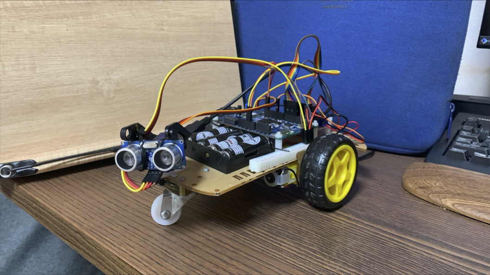
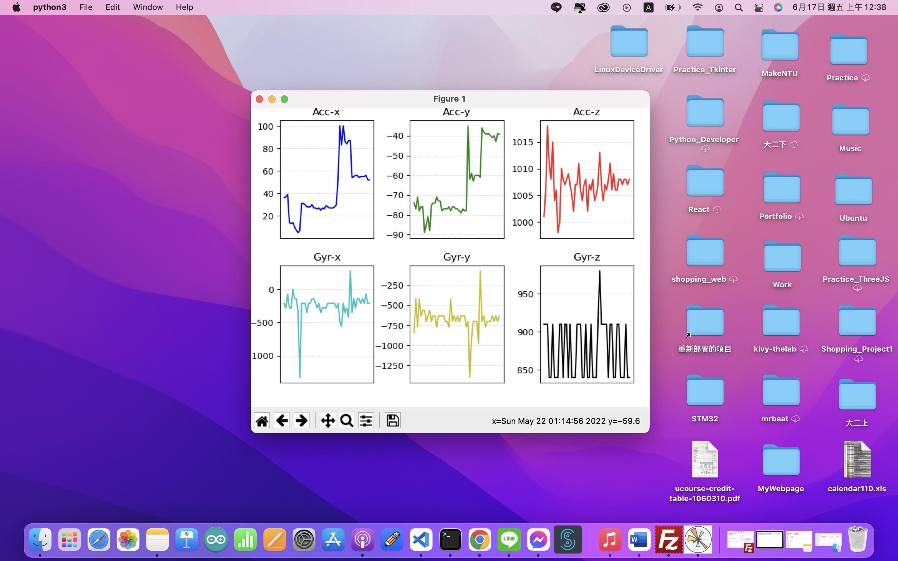
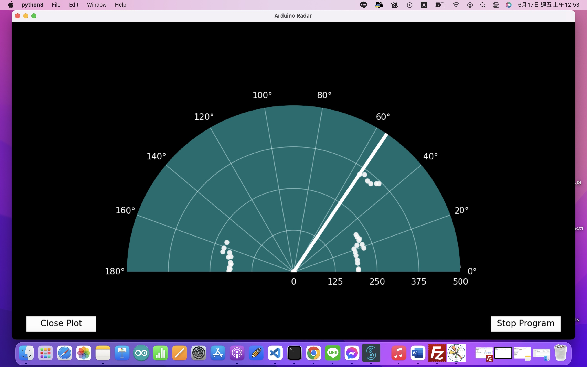
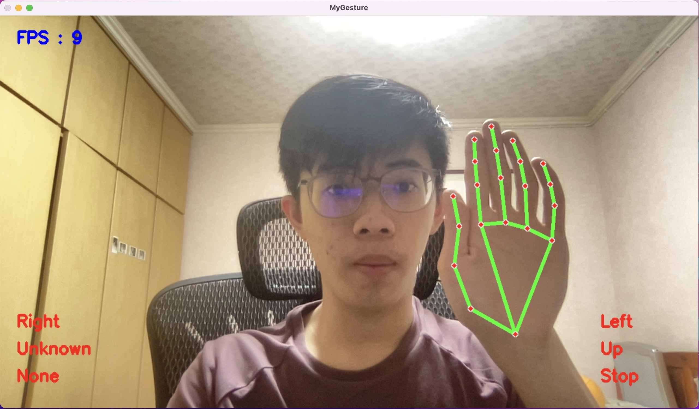
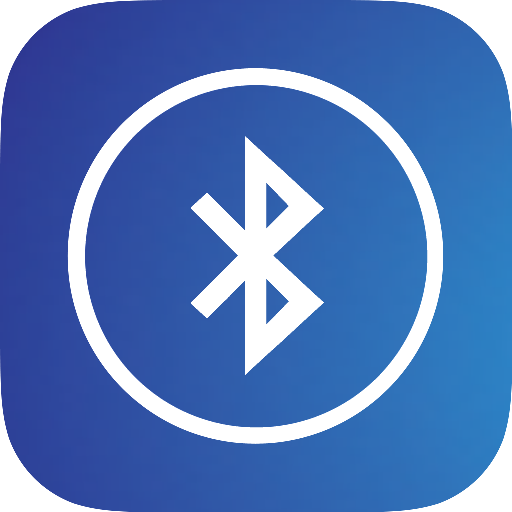

ESLab Final Project
===

# 摘要
本文會大略介紹本次期末專題的動機、作法、成果、How to Implement與參考資料。



# 動機
由於受到5G物聯網時代、火星探索車與各種多功能的智慧家電影響，本次期末專題選擇透過mbed os的各種功能搭配B-L475E-IOT01A搭載搭載的多樣Sensor與無線通訊模組來實現一台多功能的智慧車。

本次專題中大量使用的Thread、Condition Variable、Mutex、EventQueue與IRQ等功能來提升開發時的效率，並有效整合不同功能，也加入了關於DSP等進階的技巧。

# 作法

## Mbed

透過為不同功能、模組設定對應的class與其函式，有效地將不同功能同步、非同步地整合在同一台車上。

在控制板端，本次專案透過Thread將不同功能分開，並透過Condition Variable來控制不同Thread透過socket傳送資料，在`receive_http_request`中控制不同Thread在接收到指令時的反應。

而BLE與錄音的功能均透過不同的callback函式來執行對應的功能，其中，由於控制板的記憶體有限，錄音時最多一次只能錄0.25秒的音訊（預設Sample Rate為16000）。

而不同的模組也透過專屬的`class`來進行Implementation，以實現將專案物件化提升開發與維護效率的功能。

## Server & Client

透過Mediapipe與OpenCV實現手勢辨識功能，其中，Jetson Nano端的VideoCapture需要進行對應設定以充分應用GPU的效能。

透過Pymongo與Matplotlib分別存取各項資料、將資料圖像化轉換出來，並透過對應的物件分別執行。

## 整合

透過建立Socket連線，由Server連接控制板與Client以設定不同功能、傳送不同的資料，可以在`memo.json`中查看不同物件對應的資料。

# 成果
本次專案實現了5個子功能，但由於Module與控制板Hardware的限制無法同時使用，實現功能分別為：

## 1.資料圖像化
[Demo](https://youtu.be/Mk69kflESu8)



## 2.簡易雷達
[Demo](https://youtu.be/RHm4_1YgY9E)



## 3.音訊傳遞
[Demo](https://youtu.be/UVQB6Vfc58c)


## 4.手勢辨識遙控
[Demo](https://youtu.be/I0MvmhiXyvU)



## 5.遙控BLE
[Demo](https://youtu.be/5mQlsj9Lum0)



# How to Implement

## Server:

1. Install all the required python module
2. Create your DB on Mongo Atlas
3. touch `.env` file
```javascipt
DB_PASSWORD="YOUR_DB_PASSWORD"
DB_NAME="YOUR_DB_NAME"
DB_COLLECTION_NAME="YOUR_DB_COLLECTION"
SERVER_HOST="YOUR_SERVER_HOST"
SERVER_PORT=YOUR_SERVER_PORT
```
4. Run `main.py`

## Mbed:

1. Add Library: [mbed-os-ble-utils](https://github.com/ARMmbed/mbed-os-ble-utils#0da6cf31bd6688e4a3ecdf98b356e4767f3248c4)、[wifi-ism43362](https://github.com/ARMmbed/wifi-ism43362/#b8ace72b465870bffbcbe98a411b148b0163a2b1)
2. Modify or create mbed_app.json
3. Set up your WiFi data, server url and port
4. clone this repository and add everything to your project
5. build and run

## Client(PC, RPI, JetsonNano...etc)

1. Set up your os and test your camera
2. Install mediapipe and opencv for gesture recognition and all other python module
3. touch `.env` file
```javascipt
DB_PASSWORD="YOUR_DB_PASSWORD"
DB_NAME="YOUR_DB_NAME"
DB_COLLECTION_NAME="YOUR_DB_COLLECTION"
SERVER_HOST="YOUR_SERVER_HOST"
SERVER_PORT=YOUR_SERVER_PORT
```
4. Run `MyRPIClient.py`
But for RPI3B+, FPS is only about 1.

# 參考資料

## Jetson Nano設定：
https://automaticaddison.com/how-to-set-up-the-nvidia-jetson-nano-developer-kit/

## RaspberryPi手勢辨識：
https://github.com/Kazuhito00/mediapipe-python-sample/blob/main/sample_hand.py
https://zenn.dev/karaage0703/articles/63fed2a261096d
https://github.com/PINTO0309/mediapipe-bin

## .wav相關設定：
https://onestepcode.com/read-wav-header/